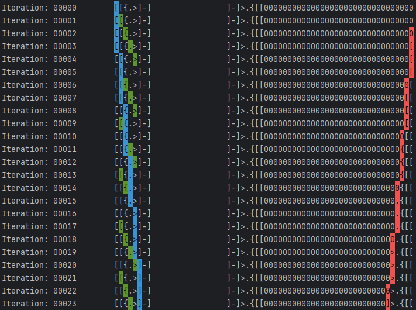

# Python implementation of BrainFuck Family

This repository is an attempt to reproduce the results of the following newly published paper:
`Computational Life: How Well-formed,
Self-replicating Programs Emerge from Simple
Interaction`: [https://arxiv.org/pdf/2406.19108](https://arxiv.org/pdf/2406.19108)

The [original source code](https://github.com/paradigms-of-intelligence/cubff) is implemented using C++ and Cuda to
achieve high performance.
This python implementation sacrifices performance for readability and ease of use.

## Getting started

The requirements for this project are very light. You only need to install the _brotli_ library which is used to
implement the compression algorithms for the metric calculations.

```bash
pip install brotli
```

The `main.py` includes a minimal implementation of the primordial soup and its update.
The higher entropy metric is also calculated every 10 epochs.

```bash
python main.py
```

### Description of the files

* **emulator.py**: The `emulate` function in this file receives a _bytearray_ tape that contains a BrainFuck program and
  emulates it. You can pass `verbose=1` to see the state of the tape at each moment of
  execution. The emulator also contains a simple self-replicating program which its executionis shown in the image
  below 

* **metrics.py**: This file include the Shanon entropy and Lempel–Ziv compression functionalities which are required to
  calculate the _higher order entropy_ metric proposed in the original paper. The _brotli_ library is used for the
  compression algorithms.
* **utils.py**: This function includes the `print_tape` utility function that allows you to print the state of a
  program. The read and write heads are highlighted using the blue and red colors and the instruction pointer is
  highlighted using green.
  in the paper.

## Notes

* I use the notion of compressibility `1.0 - (compressed_size / original_size)` to calculate the _Higher Order Entropy_.
  This creates a +1 offset in the metrics I calculate, compared to the original paper.
* I use python's default multiprocessing to speed up the execution of programs in each epoch. This speeds up the
  execution by the number of cpu cores available. On my workstation with an Intel i7-13700K, and given a soup of 2**17
  programs with 64 bytes each, each update step takes roughly 1.2 seconds.